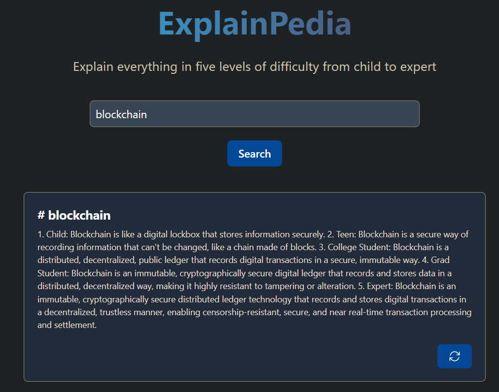

# ExplainPedia

## About this project
* This project is web application for all levels of knowledge-seekers from children to experts. Powered by the ChatGPT technology of OpenAI, Explainpedia provides straightforward and easy-to-understand explanations for a wide range of topics, from simple concepts like apples to more complex theories like the theory of relativity. To enhance user experience, Explainpedia stores search records in a database for easy retrieval.

## Features
* Provides explianation in five levels of difficulty:
    * Child
    * Teen
    * College student
    * Grad student
    * Expert

## Get Started

### Prerequisites
* Get VS Code installed
* Register for OpenAI key
* Register for Azure API key (for audio if needed)

### Procedures
  1. Open terminal. Got to a specific path.  Run `git clone https://github.com/tonylai2022/ExplainPedia-Project.git`
  2. Open the directory of this folder in VS code
  3. Open terminal in VS code
  4. Run `npm ci`
  5. Create a .env file with your own OpenAI API key 
  6. Run `node api` in a new terminal window
  7. Run `npm start` in a new terminal window
  
## Technologies used
* Node
* Express
* PostgreSQL
* Docker
* Tailwind
